<div align="center">



<br/>

# 👋 Hi, I'm **Yogendhar Sri Ram**


<p>
  <a href="https://github.com/Yogendhar123">
    
  </a>
  
</p>

<p><b>Building scalable web applications, intelligent AI experiences and modern digital products.</b></p>

</div>

---

## 🔥 ABOUT ME

```text
╭──────────────────────────────────────────────────────────────╮
│                                                              │
│  👨‍💻  Full Stack Developer                                  │
│                                                              │
│  ⚛️   React • Angular • TypeScript                           │
│  🐍   Python • FastAPI • Flask • Node.js                     │
│  🤖   AI • OpenAI • LLM-powered applications                │
│  ☁️   Azure • App Services • Cloud APIs                      │
│  📊   Power BI • Tableau • Data Visualization                │
│  🗄️   MongoDB • Azure Table Storage • REST APIs              │
│                                                              │
╰──────────────────────────────────────────────────────────────╯
```

I build responsive, scalable and production-ready applications with a strong focus on **frontend engineering, full-stack development, cloud integration and AI-powered experiences**.

---

## ⚡ TECH STACK

<div align="center">

### FRONTEND


### BACKEND


### DATABASE • CLOUD • DEVOPS


</div>

---

## 🚀 WHAT I BUILD

<table>
<tr>
<td width="50%">

### ⚛️ Modern Web

React and Angular applications with responsive UI, reusable components, API integration and interactive data experiences.

</td>
<td width="50%">

### 🤖 AI Applications

AI-powered workflows using Python, OpenAI/LLM APIs, Streamlit and modern web interfaces.

</td>
</tr>
<tr>
<td width="50%">

### ☁️ Cloud Solutions

Azure-based applications, storage integrations, APIs, deployments and containerized services.

</td>
<td width="50%">

### 📊 Data Experiences

Power BI, Tableau and custom web dashboards for turning data into useful insights.

</td>
</tr>
</table>

---

## 🎓 CERTIFICATIONS

<div align="center">

<a href="https://www.credly.com/badges/6e9de643-68f8-4bf6-8dd0-853015d972ed">

</a>

<br/><br/>

<a href="https://www.credly.com/badges/6e9de643-68f8-4bf6-8dd0-853015d972ed">
  
</a>

</div>

- **Issuer:** Anthropic
- **Issued:** Sep 2026 · **Expires:** Sep 2027
- **Credential ID:** ANTH516426
- **Score:** 884 / 1000 — Pass

---

## 💼 FEATURED PROJECTS

### 🔵 AI & Full Stack Applications

> Building production-oriented applications combining **React + Python + AI + Azure**.

**Stack:** `React` `TypeScript` `Python` `FastAPI` `Azure` `AI`

### 🔷 Interactive Data Platforms

> Creating modern dashboards and data-driven experiences using **Power BI, Tableau and custom React interfaces**.

**Stack:** `React` `Power BI` `Tableau` `REST APIs`

### 🔹 Cloud & API Integrations

> Developing scalable frontend/backend systems with cloud storage, authentication, APIs and deployment automation.

**Stack:** `Node.js` `FastAPI` `Azure` `MongoDB` `Docker`

---

## 📊 GITHUB ANALYTICS

<div align="center">


<br/><br/>


</div>

---

## 🏆 ACHIEVEMENTS

<div align="center">


</div>

---

## 🐍 CONTRIBUTION JOURNEY

<div align="center">


</div>

---

## 📈 MY DEVELOPMENT FLOW

```text
       IDEA
        │
        ▼
   ┌───────────┐
   │   DESIGN  │
   └─────┬─────┘
         │
         ▼
   ┌───────────┐
   │  DEVELOP  │──────► React / Angular
   └─────┬─────┘
         │
         ▼
   ┌───────────┐
   │ AI / API  │──────► Python / FastAPI / Node
   └─────┬─────┘
         │
         ▼
   ┌───────────┐
   │  CLOUD    │──────► Azure / Docker
   └─────┬─────┘
         │
         ▼
      🚀 SHIP
```

---

## 📫 CONNECT WITH ME

<div align="center">

<a href="https://github.com/Yogendhar123">

</a>

<a href="https://in.linkedin.com/in/yogendhar">

</a>

<a href="mailto:yogendharbolisetti@gmail.com">

</a>

<br/><br/>

# 🔵 LET'S BUILD SOMETHING GREAT.

**React • Angular • Python • Node.js • MongoDB • Azure • AI**

<br/>

⭐ Thanks for visiting my profile!

</div>
